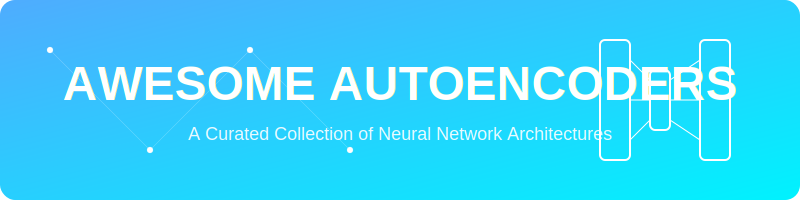

  

<h1 align="center">🚀 Awesome Autoencoders</h1>

  <strong>A curated list of various autoencoder architectures, seminal papers, and detailed documentation.</strong>

  
  
  
  

---

## 📖 Introduction to Autoencoders

**Autoencoders** are unsupervised neural networks designed to compress input data into a lower-dimensional **latent space** and reconstruct it. They are primarily applied in:
- 📉 **Dimensionality Reduction**
- 🔍 **Anomaly Detection**
- 🎨 **Generative Modeling**
- 🧹 **Data Denoising**

---

## 🛠️ Key Autoencoder Architectures

Discover the most influential autoencoder models used in modern AI and Deep Learning.

### 1. 🎨 Variational Autoencoders (VAEs)
*   **📅 First Used:** 2013
*   **📄 Seminal Paper:** [Auto-Encoding Variational Bayes](https://arxiv.org/abs/1312.6114)
*   **🧠 How they work:** VAEs learn the *probability distribution* of data rather than mapping inputs to fixed vectors. This allows for sampling and generating entirely new data.
*   **💡 Use Cases:** Image generation, data augmentation, and latent interpolation.
*   **🔗 Detailed Info:** [Deep Dive into VAEs](./docs/variational-autoencoders.md)

### 🖼️ 2. Convolutional Autoencoders (CAEs)
*   **📅 First Used:** 2011
*   **📄 Seminal Paper:** [Stacked Convolutional Auto-Encoders for Hierarchical Feature Extraction](https://www.researchgate.net/publication/221078652_Stacked_Convolutional_Auto-Encoders_for_Hierarchical_Feature_Extraction)
*   **🧠 How they work:** CAEs replace standard layers with convolutional layers, preserving spatial hierarchies in pixel-based data.
*   **💡 Use Cases:** Image compression, image segmentation, and facial feature extraction.
*   **🔗 Detailed Info:** [Deep Dive into CAEs](./docs/convolutional-autoencoders.md)

### 🧼 3. Denoising Autoencoders (DAEs)
*   **📅 First Used:** 2008
*   **📄 Seminal Paper:** [Extracting and Composing Robust Features with Denoising Autoencoders](https://dl.acm.org/doi/10.1145/1390156.1390294)
*   **🧠 How they work:** DAEs are trained to reconstruct clean data from corrupted inputs, forcing the model to learn robust, fundamental patterns.
*   **💡 Use Cases:** Image denoising, audio enhancement, and robust feature extraction.
*   **🔗 Detailed Info:** [Deep Dive into DAEs](./docs/denoising-autoencoders.md)

### 🕸️ 4. Sparse Autoencoders (SAEs)
*   **📅 First Used:** 2007
*   **📄 Seminal Paper:** [Sparse Feature Learning for Deep Belief Networks](https://proceedings.neurips.cc/paper/2007/hash/836696dc7909383818e11f074744d2d4-Abstract.html)
*   **🧠 How they work:** Applies a penalty that limits the number of active neurons (sparsity constraint), extracting granular, distinct features.
*   **💡 Use Cases:** Feature extraction and uncovering hidden structural patterns in datasets.
*   **🔗 Detailed Info:** [Deep Dive into Sparse Autoencoders](./docs/sparse-autoencoders.md)

### 📝 5. Sequence / Natural Language Autoencoders
*   **📅 First Used:** 2014
*   **📄 Seminal Paper:** [Sequence to Sequence Learning with Neural Networks](https://arxiv.org/abs/1409.3215)
*   **🧠 How they work:** Adapted for sequential data (like RNNs/LSTMs), encoding variable-length text into a fixed-length vector and decoding it back.
*   **💡 Use Cases:** Neural machine translation, sentence generation, and time-series anomaly detection.
*   **🔗 Detailed Info:** [Deep Dive into Sequence Autoencoders](./docs/sequence-autoencoders.md)

### 🛒 6. AutoRec & DeepRec (Recommendation Systems)
*   **📅 First Used:** 2015
*   **📄 Seminal Paper:** [AutoRec: Autoencoders Meet Collaborative Filtering](https://dl.acm.org/doi/10.1145/2740908.2742726)
*   **🧠 How they work:** Uses autoencoder architectures to predict missing values in a user-item matrix for collaborative filtering.
*   **💡 Use Cases:** Recommendation engines and personalized content delivery.
*   **🔗 Detailed Info:** [Deep Dive into AutoRec](./docs/autorec.md)

---

## 📺 Recommended Tutorial Video

For a visual breakdown of how Autoencoders work and how to implement them, check out this guide:

  

---

## 📊 Star History

   <a href="https://www.star-history.com/?repos=ishandutta2007%2FAwesome-Autoencoders&type=date&legend=bottom-right">
    <picture>
      <source media="(prefers-color-scheme: dark)" srcset="https://api.star-history.com/chart?repos=ishandutta2007/Awesome-Autoencoders&type=date&theme=dark&legend=bottom-right" />
      <source media="(prefers-color-scheme: light)" srcset="https://api.star-history.com/chart?repos=ishandutta2007/Awesome-Autoencoders&type=date&legend=bottom-right" />
      
    </picture>
   </a>

---

## 🤝 Contributing

Contributions are welcome! If you have a seminal paper or a new autoencoder architecture to add, please feel free to:
1. Fork the project.
2. Create your feature branch.
3. Commit your changes.
4. Push to the branch.
5. Open a Pull Request.

---

## 📄 License

Distributed under the MIT License. See `LICENSE` for more information.

---

  Made with ❤️ for the AI Community

<!-- SEO Keywords: Autoencoders, Deep Learning, VAE, CAE, Denoising Autoencoders, Sparse Autoencoders, Seq2Seq, AutoRec, Neural Networks, Machine Learning Papers -->
