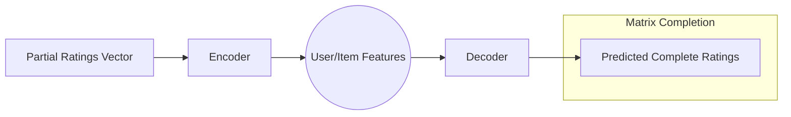

# AutoRec & DeepRec (Recommendation Autoencoders)

AutoRec is an autoencoder framework for collaborative filtering that predicts missing ratings in a user-item matrix.

## How They Work
The input is a partially filled rating vector (e.g., a user's ratings for various movies). The autoencoder is trained to reconstruct the full vector, effectively predicting the ratings for items the user hasn't seen yet.

### Architecture Diagram

## Key Innovation
AutoRec was one of the first models to show that autoencoders could outperform classical Matrix Factorization techniques for recommendation tasks by capturing non-linear relationships.

## Seminal Paper
- **Title:** [AutoRec: Autoencoders Meet Collaborative Filtering](https://dl.acm.org/doi/10.1145/2740908.2742726)
- **Authors:** Suvash Sedhain, Aditya Krishna Menon, Scott Sanner, Lexing Xie
- **Year:** 2015

## Use Cases
- **Movie Recommendations:** Suggesting new films based on previous ratings.
- **E-commerce:** Personalized product suggestions.
- **Music Streaming:** Curating playlists based on listening history.

---
[Back to README](../README.md)
