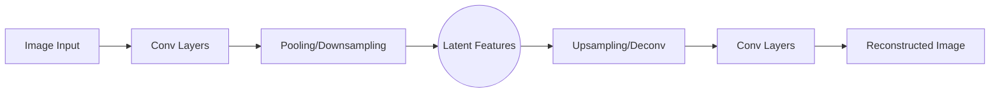

# Convolutional Autoencoders (CAEs)

Convolutional Autoencoders are a variant of autoencoders that use convolutional layers to handle 2D data, such as images.

## How They Work
Traditional autoencoders use fully connected layers, which ignore the spatial structure of images. CAEs use convolutional layers in the encoder to extract features and transpose convolutional layers (or upsampling) in the decoder to reconstruct the image.

### Architecture Diagram

## Key Innovation
By using shared weights and local connectivity, CAEs significantly reduce the number of parameters compared to fully connected autoencoders while preserving spatial hierarchies.

## Seminal Paper
- **Title:** [Stacked Convolutional Auto-Encoders for Hierarchical Feature Extraction](https://www.researchgate.net/publication/221078652_Stacked_Convolutional_Auto-Encoders_for_Hierarchical_Feature_Extraction)
- **Authors:** Jonathan Masci, Ueli Meier, Dan Cireşan, Jürgen Schmidhuber
- **Year:** 2011

## Use Cases
- **Image Compression:** Efficiently encoding image data.
- **Denoising:** Removing noise while preserving edges and textures.
- **Feature Learning:** Unsupervised pre-training for downstream computer vision tasks.

---
[Back to README](../README.md)
