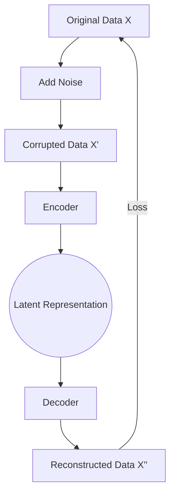

# Denoising Autoencoders (DAEs)

Denoising Autoencoders are trained to reconstruct a clean input from a corrupted version of it.

## How They Work
The model is fed a version of the input data that has been partially corrupted by noise (e.g., Gaussian noise or dropout). The loss function compares the decoder's output to the *original clean input*, forcing the model to learn the underlying manifold of the data to "fill in the blanks."

### Architecture Diagram

## Key Innovation
DAEs prevent the autoencoder from simply learning the identity function. Instead, it must learn the statistical dependencies between the inputs to successfully remove the noise.

## Seminal Paper
- **Title:** [Extracting and Composing Robust Features with Denoising Autoencoders](https://dl.acm.org/doi/10.1145/1390156.1390294)
- **Authors:** Pascal Vincent, Hugo Larochelle, Yoshua Bengio, Pierre-Antoine Manzagol
- **Year:** 2008

## Use Cases
- **Image Restoration:** Cleaning up grainy or damaged images.
- **Robust Feature Extraction:** Learning features that are invariant to small perturbations in the input.
- **Pre-training:** Initializing deep networks with robust weights.

---
[Back to README](../README.md)
