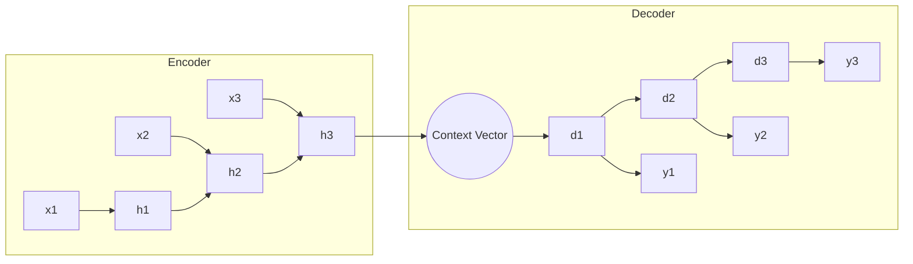

# Sequence Autoencoders (Seq2Seq AEs)

Sequence Autoencoders are designed to handle variable-length sequential data, such as text, audio, or time-series.

## How They Work
They typically use Recurrent Neural Networks (RNNs), Long Short-Term Memory (LSTM) units, or Gated Recurrent Units (GRUs). The encoder processes the sequence step-by-step and produces a final "context vector" that represents the entire sequence. The decoder then reconstructs the sequence from this vector.

### Architecture Diagram

## Key Innovation
The ability to map a variable-length input to a fixed-length representation (the context vector) and then back to a variable-length output is the foundation of modern machine translation.

## Seminal Paper
- **Title:** [Sequence to Sequence Learning with Neural Networks](https://arxiv.org/abs/1409.3215)
- **Authors:** Ilya Sutskever, Oriol Vinyals, Quoc V. Le
- **Year:** 2014
- **Note:** See also [Learning Phrase Representations using RNN Encoder-Decoder for Statistical Machine Translation](https://arxiv.org/abs/1406.1078) (Cho et al., 2014).

## Use Cases
- **Machine Translation:** Translating sentences from one language to another.
- **Text Summarization:** Compressing long articles into shorter versions.
- **Anomaly Detection in Time-Series:** Detecting unusual patterns in sensor data.

---
[Back to README](../README.md)
