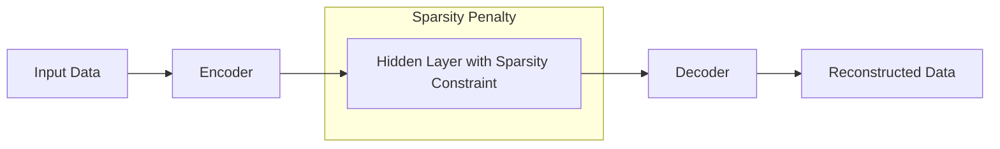

# Sparse Autoencoders (SAEs)

Sparse Autoencoders are a type of autoencoder where the hidden layer has a sparsity constraint, forcing only a small number of neurons to be active at any given time.

## How They Work
The network is typically "overcomplete" (the hidden layer is larger than the input layer). To prevent the model from learning a trivial identity mapping, a penalty term is added to the loss function that encourages the average activation of neurons in the hidden layer to be near zero.

### Architecture Diagram

## Key Innovation
By enforcing sparsity, the model is forced to find unique, non-redundant features in the data. This is similar to how the human primary visual cortex (V1) is thought to encode visual information.

## Seminal Paper / Reference
- **Title:** [Sparse Feature Learning for Deep Belief Networks](https://proceedings.neurips.cc/paper/2007/hash/836696dc7909383818e11f074744d2d4-Abstract.html)
- **Authors:** Marc'Aurelio Ranzato, Fu Jie Huang, Y-Lan Boureau, Yann LeCun
- **Year:** 2007
- **Note:** Also popularized by [Andrew Ng's CS294A Lecture Notes](https://web.stanford.edu/class/cs294a/sparseAutoencoder.pdf) (2011).

## Use Cases
- **Feature Discovery:** Uncovering rare but important patterns in large datasets.
- **Bioinformatics:** Identifying specific gene expression patterns.
- **Compression:** Encoding data into a format where only a few "bits" are active.

---
[Back to README](../README.md)
