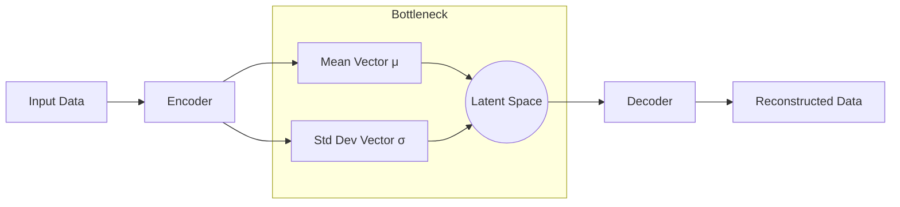

# Variational Autoencoders (VAEs)

Variational Autoencoders (VAEs) are a class of generative models that provide a probabilistic manner for describing an observation in latent space.

## How They Work
Instead of mapping an input to a fixed vector, VAEs map inputs to a distribution (mean and variance). A point is then sampled from this distribution to be decoded. This ensures that the latent space is continuous and can be sampled to generate new data.

### Architecture Diagram

## Key Innovation: The Reparameterization Trick
To allow backpropagation through a stochastic node, VAEs use the reparameterization trick:
$z = \mu + \sigma \odot \epsilon$
where $\epsilon \sim \mathcal{N}(0, 1)$.

## Seminal Paper
- **Title:** [Auto-Encoding Variational Bayes](https://arxiv.org/abs/1312.6114)
- **Authors:** Diederik P. Kingma, Max Welling
- **Year:** 2013

## Use Cases
- **Image Generation:** Creating new images that look like the training set.
- **Data Augmentation:** Generating synthetic data for training other models.
- **Anomaly Detection:** Identifying data points with low probability under the learned distribution.

---
[Back to README](../README.md)
